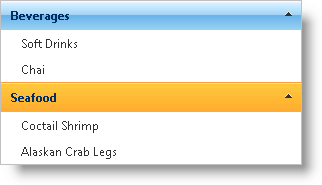

////

|metadata|
{
    "name": "webexplorerbar-binding-to-an-xml-data-source",
    "controlName": ["WebExplorerBar"],
    "tags": ["Data Binding","How Do I"],
    "guid": "{FAFD6134-AF4F-44EC-B218-40569FFC87FC}",  
    "buildFlags": [],
    "createdOn": "2010-01-03T22:37:42Z"
}
|metadata|
////

= Binding to an XML Data Source

== Before You Begin

The WebExplorerBar™ can bind to a hierarchical data source, displaying each level of the data hierarchy. The topmost level represents the different groupings, with each child level representing the items.

== What You Will Accomplish

You will learn how to bind to data using the WebExplorerBar control and an XmlDataSource component. The sample uses the link:code-files-categoriesandproducts.html[CategoriesandProducts] file.

== Follow These Steps

[start=1]
. Drag a ScriptManager component from the Visual Studio™ Toolbox onto the web page.
[start=2]
. Drag a WebExplorerBar control onto the page.
[start=3]
. Drag an XmlDataSource component onto the page.
[start=4]
. Set up the XmlDataSource component to retrieve data using an XML file.

.. Set the DataFile property to the location of the data file.
.. Set the XPath property to select the Category nodes.

*In HTML:*

----
<asp:XmlDataSource 
        ID="XmlDataSource1" 
        runat="server" 
        DataFile="~/App_Data/CategoriesAndProducts.xml" 
        XPath="Categories/Category"> 
</asp:XmlDataSource>
----

[start=5]
. Set WebExplorerBar's  pick:[asp-net="link:infragistics4.web.v{ProductVersion}~infragistics.web.ui.navigationcontrols.webexplorerbar~datasourceid.html[DataSourceID]"]  property to XmlDataSource1, the id of the XmlDataSource component.
[start=6]
. Set the data bindings to display the CategoryName and ProductName attributes from the Category and Product nodes, respectively.

.. Create a  pick:[asp-net="link:infragistics4.web.v{ProductVersion}~infragistics.web.ui.navigationcontrols.explorerbaritembinding.html[ExplorerBarItemBinding]"]  object and set its  pick:[asp-net="link:infragistics4.web.v{ProductVersion}~infragistics.web.ui.navigationcontrols.explorerbaritembinding~datamember.html[DataMember]"]  property to "Category".
.. Set the  pick:[asp-net="link:infragistics4.web.v{ProductVersion}~infragistics.web.ui.navigationcontrols.explorerbaritembinding~textfield.html[TextField]"]  property to "CategoryName".
.. Create a second ExplorerBarItemBinding object and set its DataMember property to "Product".
.. Set the TextField property to "ProductName".

*In HTML:*

----
<ig:WebExplorerBar ID="WebExplorerBar1" runat="server" Width="300px" DataSourceID="XmlDataSource1" BehaveMode="AnyExpandable">
    <DataBindings>
        <ig:WebExplorerBinding DataMember="Category" TextField="CategoryName" />
        <ig:WebExplorerBinding DataMember="Product" TextField="ProductName" />
    </DataBindings>
</ig:WebExplorerBar>
----

[start=7]
. Run the application. The WebExplorerBar control displays the data from the Category and Product nodes.

== Related Topics

link:webexplorerbar-smart-tag.html[WebExplorerBar Smart Tag]

link:webexplorerbar-keyboard-navigation.html[Keyboard Navigation]

link:webexplorerbar-display-modes.html[Display Modes]

link:webexplorerbar-height-properties.html[WebExplorerBar Height Properties]

link:webexplorerbar-setting-navigateurl-and-target-properties.html[Setting NavigateURL and Target Properties]

link:webexplorerbar-binding-to-webhierarchcialdatasource.html[Binding to WebHierarchcialDataSource]

link:webexplorerbar-serverevents.html[Server-Side Events]

link:webexplorerbar-selection-behavior.html[Selection Behavior]

link:webexplorerbar-clientside-api.html[ClientSide API]

link:webexplorerbar-clientevents.html[Client-Side Events]

link:webexplorerbar-styling.html[CSS Class Properties]