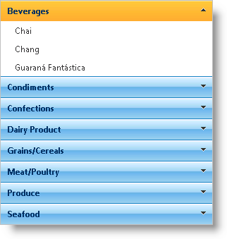

////

|metadata|
{
    "name": "webexplorerbar-binding-to-webhierarchcialdatasource",
    "controlName": ["WebExplorerBar"],
    "tags": ["Data Binding","How Do I"],
    "guid": "{A6861AD3-B594-41FC-88EB-251F7E129C6E}",  
    "buildFlags": [],
    "createdOn": "2010-01-03T22:39:20Z"
}
|metadata|
////

= Binding to WebHierarchcialDataSource

== Before You Begin

The WebExplorerBar™ can bind to a hierarchical data source, displaying each level of the data hierarchy. The topmost level represents the different groupings, with each child level representing the items.

== What You Will Accomplish

You will learn how to bind WebExplorerBar to the WebHierarchicalDataSource component using AccessDataSource components.

== Follow These Steps

[start=1]
. Drag a ScriptManager component from the Visual Studio™ Toolbox onto the web page.
[start=2]
. Drag a WebExplorerBar control onto the page.
[start=3]
. Drag a WebHierarchicalDataSource component onto the page.
[start=4]
. Set the WebHierarchicalDataSource to use 2 AccessDataSource components to retrieve the Categories and Products data from Nortwind database. If you need a detailed walkthrough for using the WebHierarchicalDataSource, see link:webhierarchicaldatasource-getting-started-with-webhierarchicaldatasource.html[Getting Started with WebHierarchicalDataSource]. After setting up the WebHierarchicalDataSource component, you will have the following markup.

*In HTML:*

----
    <asp:AccessDataSource ID="CategoriesDS" runat="server" DataFile="~/App_Data/Nwind.mdb"
        SelectCommand="SELECT Categories.CategoryID, Categories.CategoryName FROM Categories ">
    </asp:AccessDataSource>
    <asp:AccessDataSource ID="ProductsDS" runat="server" DataFile="~/App_Data/Nwind.mdb"
        SelectCommand="SELECT Products.ProductID, Products.ProductName, Products.CategoryID FROM Products ">
    </asp:AccessDataSource>
    <ig:WebHierarchicalDataSource ID="whds" runat="server">
        <DataViews>
            <ig:DataView DataSourceID="CategoriesDS" ID="Categories" />
            <ig:DataView DataSourceID="ProductsDS" ID="Products" />
        </DataViews>
        <DataRelations>
            <ig:DataRelation ParentDataViewID="Categories" ParentColumns="CategoryID" ChildDataViewID="Products"
                ChildColumns="CategoryID" />
        </DataRelations>
    </ig:WebHierarchicalDataSource>
----

.Note:
[NOTE]
====
For clarity, the data view's id properties have been changed from the default values set by WebHierarchicalDataSource.
====

[start=5]
. Set WebExplorerBar's DataSourceID property to WebHierarchicalDataSource1—the id of the WebHierarchicalDataSource component.
[start=6]
. Set the data bindings for WebExplorerBar's items to display the CategoryName and ProductName properties of the Categories data view and Products data view, respectively.

.. Add a ExplorerBarItemBinding object to the DataBindings collection.
.. Set the DataMember property to CategoriesDataview.
.. Set the TextField property to CategoryName.
.. Add another ExplorerBarItemBinding object to the collection.
.. Set the DataMember to ProductsDataview and the TextField to ProductName.

*In HTML:*

----
   <ig:WebExplorerBar GroupExpandBehavior="SingleExpanded" MaxGroupHeight="200px" DataSourceID="whds"  
         InitialDataBindDepth="0" ID="WebExplorerBar1" runat="server" Width="300px">
        <DataBindings>
            <ig:ExplorerBarItemBinding DataMember="Categories" TextField="CategoryName" />
            <ig:ExplorerBarItemBinding DataMember="Products" TextField="ProductName" />
        </DataBindings>
    </ig:WebExplorerBar>
----

[start=7]
. Run the application. The WebExplorerBar control displays the groups and items based on the hierarchical data source it is bound to.

== Related Topics

link:webexplorerbar-smart-tag.html[WebExplorerBar Smart Tag]

link:webexplorerbar-keyboard-navigation.html[Keyboard Navigation]

link:webexplorerbar-display-modes.html[Display Modes]

link:webexplorerbar-height-properties.html[WebExplorerBar Height Properties]

link:webexplorerbar-setting-navigateurl-and-target-properties.html[Setting NavigateURL and Target Properties]

link:webexplorerbar-binding-to-an-xml-data-source.html[Binding to an XML Data Source]

link:webexplorerbar-serverevents.html[Server-Side Events]

link:webexplorerbar-selection-behavior.html[Selection Behavior]

link:webexplorerbar-clientside-api.html[ClientSide API]

link:webexplorerbar-clientevents.html[Client-Side Events]

link:webexplorerbar-styling.html[CSS Class Properties]