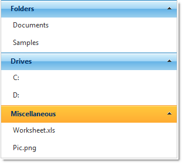

////

|metadata|
{
    "name": "webexplorerbar-getting-started-with-webexplorerbar",
    "controlName": ["WebExplorerBar"],
    "tags": ["Getting Started","Grouping"],
    "guid": "{DA54D236-F191-4CB7-8872-87F2A8AC3C10}",  
    "buildFlags": [],
    "createdOn": "2010-01-03T22:44:37Z"
}
|metadata|
////

= Getting Started with WebExplorerBar

== Before You Begin

The WebExplorerBar™ control allows you to display groups and items without binding to a data source. You can do this by adding groups and items at design time or in code-behind.

== What You will Accomplish

You will learn how to add groups and items to WebExplorerBar.

== Follow these Steps

[start=1]
. Drag a ScriptManager component from the Visual Studio™ Toolbox onto the web page.
[start=2]
. Drag a WebExplorerBar control onto the page.
[start=3]
. Add an link:{ApiPlatform}web{ApiVersion}~infragistics.web.ui.navigationcontrols.explorerbargroup.html[ExplorerBarGroup] object to the group collection using the link:{ApiPlatform}web{ApiVersion}~infragistics.web.ui.navigationcontrols.webexplorerbar~groups.html[Groups] property of WebExplorerBar.

*In HTML:*

----
<ig:WebExplorerBar ID="WebExplorerBar1" runat="server" GroupExpandBehavior="AnyExpandable">
        <Groups>
            <ig:ExplorerBarGroup Text="Folders">
            <%--TODO: Add items--%>
            </ig:ExplorerBarGroup>
        </Groups>
</ig:WebExplorerBar>
----

*In Visual Basic:*

----
' Group 1 
Dim group As New ExplorerBarGroup() 
group.Text = "Folders" 
Me.WebExplorerBar1.Groups.Add(group)
----

*In C#:*

----
// Group 1
ExplorerBarGroup group = new ExplorerBarGroup();
group.Text = "Folders";
this.WebExplorerBar1.Groups.Add(group);
----

[start=4]
. Add 2 ExplorerBarItem objects to the item collection using the link:{ApiPlatform}web{ApiVersion}~infragistics.web.ui.navigationcontrols.explorerbaritemcollection.html[Items] property.
[start=5]
. Set the link:{ApiPlatform}web{ApiVersion}~infragistics.web.ui.navigationcontrols.explorerbaritembase~text.html[Text] property to "Documents" for one link:{ApiPlatform}web{ApiVersion}~infragistics.web.ui.navigationcontrols.explorerbaritem.html[ExplorerBarItem] object and "Samples" for the other.

*In HTML:*

----
<Items>
   <ig:ExplorerBarItem Text="Documents" />
   <ig:ExplorerBarItem Text="Samples" />
</Items>
----

*In Visual Basic:*

----
Dim item As New ExplorerBarItem() 
item.Text = "Documents" 
group.Items.Add(item) 
item = New ExplorerBarItem() 
item.Text = "Samples" 
group.Items.Add(item)
----

*In C#:*

----
ExplorerBarItem item = new ExplorerBarItem();
item.Text = "Documents";
group.Items.Add(item);
item = new ExplorerBarItem();
item.Text = "Samples";
group.Items.Add(item);
----

[start=6]
. Repeat steps 3 and 4 two more times to get 2 more groups and set the text according to the following sample code.

*In HTML:*

----
<ig:ExplorerBarGroup Text="Drives">
    <Items>
       <ig:ExplorerBarItem Text="C:" />
       <ig:ExplorerBarItem Text="D:" />
    </Items>
 </ig:ExplorerBarGroup>
 <ig:ExplorerBarGroup  Text="Miscellaneous">
     <Items>
        <ig:ExplorerBarItem Text="Worksheet.xls" />
        <ig:ExplorerBarItem Text="Pic.png" />
     </Items>
</ig:ExplorerBarGroup>
----

*In Visual Basic:*

----
' Group 2 
group = New ExplorerBarGroup() 
group.Text = "Drives" 
Me.WebExplorerBar1.Groups.Add(group) 
item = New ExplorerBarItem() 
item.Text = "C:" 
group.Items.Add(item) 
item = New ExplorerBarItem() 
item.Text = "D:" 
group.Items.Add(item) 
' Group 3 
group = New ExplorerBarGroup() 
group.Text = "Miscellaneous" 
Me.WebExplorerBar1.Groups.Add(group) 
item = New ExplorerBarItem() 
item.Text = "Worksheet.xls" 
group.Items.Add(item) 
item = New ExplorerBarItem() 
item.Text = "Pic.png" 
group.Items.Add(item)
----

*In C#:*

----
// Group 2
group = new ExplorerBarGroup();
group.Text = "Drives";
this.WebExplorerBar1.Groups.Add(group);
item = new ExplorerBarItem();
item.Text = "C:";
group.Items.Add(item);
item = new ExplorerBarItem();
item.Text = "D:";
group.Items.Add(item);
// Group 3
group = new ExplorerBarGroup();
group.Text = "Miscellaneous";
this.WebExplorerBar1.Groups.Add(group);
item = new ExplorerBarItem();
item.Text = "Worksheet.xls";
group.Items.Add(item);
item = new ExplorerBarItem();
item.Text = "Pic.png";
group.Items.Add(item);
----

[start=7]
. Run the application. The WebExplorerBar control displays 3 groups with sub-items.

== Related Topics

link:webexplorerbar-about-webexplorerbar.html[About WebExplorerBar]

link:webexplorerbar-using-webexplorerbar.html[Using WebExplorerBar]