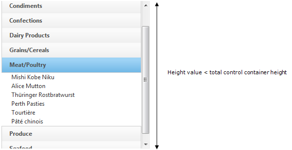
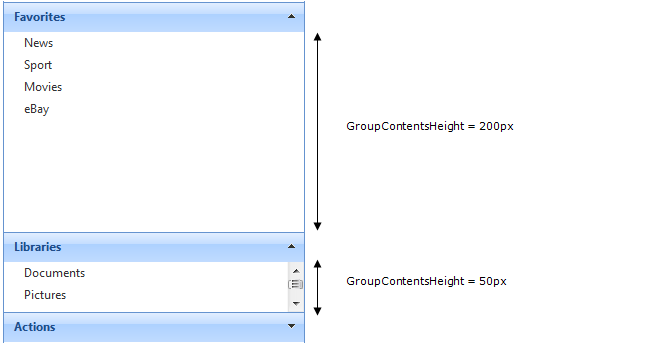
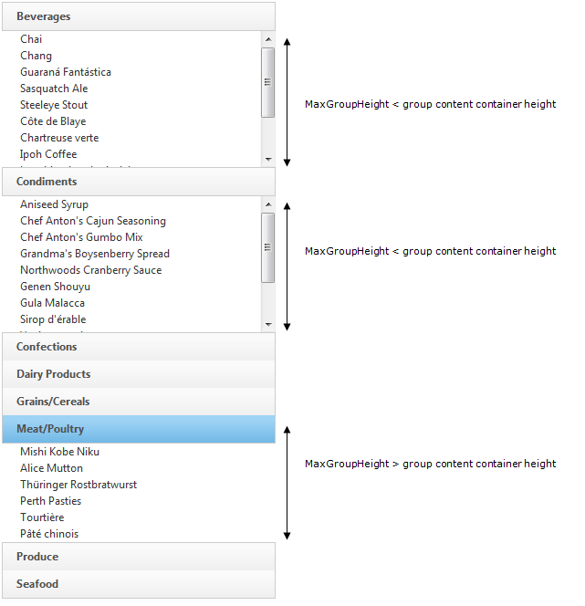

////

|metadata|
{
    "name": "webexplorerbar-height-properties",
    "controlName": ["WebExplorerBar"],
    "tags": ["API","How Do I","Styling"],
    "guid": "{0DB3838A-E7A2-4609-B5B3-079F5621468E}",  
    "buildFlags": [],
    "createdOn": "2010-01-03T22:54:46Z"
}
|metadata|
////

= WebExplorerBar Height Properties

Configuring the height of WebExplorerBar™ can be done by using control’s  pick:[asp-net="link:infragistics4.web.v{ProductVersion}~infragistics.web.ui.navigationcontrols.webexplorerbar~height.html[Height]"]  ,  pick:[asp-net="link:infragistics4.web.v{ProductVersion}~infragistics.web.ui.navigationcontrols.webexplorerbar~groupcontentsheight.html[GroupContentsHeight]"]  and  pick:[asp-net="link:infragistics4.web.v{ProductVersion}~infragistics.web.ui.navigationcontrols.webexplorerbar~maxgroupheight.html[MaxGroupHeight]"]  properties.

* Height – Specifies control container height; if WebExplorerBar Groups and Items content Height exceed the Height property value, a scrollbar occurs.

Height value < total control container height

* GroupContentsHeight – Sets the content container height of the WebExplorerBar group(s) as a fixed value. If the group content height exceeds the GroupContentsHeight property value, a scrollbar occurs. The height is always fixed at the specified value, no matter how many items are in the group. There are two ways to set the value of GroupContentsHeight:

** From control level – Specifies the height for all groups’ content.
** From group level – Specifies the height value only for the group that declares it.

.Note:
[NOTE]
====
Setting GroupContentsHeight property from group level has higher priority.
====

* MaxGroupHeight – Sets maximum height of WebExplorerBar group’s content. If a group content height exceeds the MaxGroupHeight value, a scrollbar occurs. Height of the content varies, depending on how many items are in the group. Therefore it cannot happen that there is unused space below the items, if their total height is less than the MaxGroupHeight.

.Note:
[NOTE]
====
MaxGroupHeight property value is not persisted after postback. It takes the group content height dynamically and if a postback occurs MaxGroupHeight property value won’t be applied to any expanded group.
====

*Recommendations:* Use MaxGroupHeight property with no group expanded when page is loaded. You can either use GroupExpandBehavior property set to AnyExpandable or collapse all groups when the page is loading.

== Related Topics

link:webexplorerbar-smart-tag.html[WebExplorerBar Smart Tag]

link:webexplorerbar-keyboard-navigation.html[Keyboard Navigation]

link:webexplorerbar-display-modes.html[Display Modes]

link:webexplorerbar-setting-navigateurl-and-target-properties.html[Setting NavigateURL and Target Properties]

link:webexplorerbar-binding-to-an-xml-data-source.html[Binding to an XML Data Source]

link:webexplorerbar-binding-to-webhierarchcialdatasource.html[Binding to WebHierarchcialDataSource]

link:webexplorerbar-serverevents.html[Server-Side Events]

link:webexplorerbar-selection-behavior.html[Selection Behavior]

link:webexplorerbar-clientside-api.html[ClientSide API]

link:webexplorerbar-clientevents.html[Client-Side Events]

link:webexplorerbar-styling.html[CSS Class Properties]