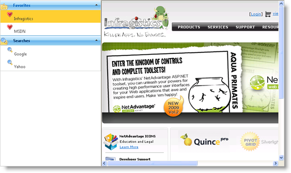

////

|metadata|
{
    "name": "webexplorerbar-setting-navigateurl-and-target-properties",
    "controlName": ["WebExplorerBar"],
    "tags": ["How Do I","Layouts","Navigation"],
    "guid": "{84E214A6-634B-4635-9BB0-EAFE3EB0A6E9}",  
    "buildFlags": [],
    "createdOn": "2010-01-03T22:58:30Z"
}
|metadata|
////

= Setting NavigateURL and Target Properties

You can use WebExplorerBar™ as a navigational layout for your pages. The control's  pick:[asp-net="link:infragistics4.web.v{ProductVersion}~infragistics.web.ui.navigationcontrols.explorerbargroup.html[ExplorerBarGroup]"]  and  pick:[asp-net="link:infragistics4.web.v{ProductVersion}~infragistics.web.ui.navigationcontrols.explorerbaritem.html[ExplorerBarItem]"]  objects have a  pick:[asp-net="link:infragistics4.web.v{ProductVersion}~infragistics.web.ui.navigationcontrols.explorerbaritembase~navigateurl.html[NavigateUrl]"]  property and a  pick:[asp-net="link:infragistics4.web.v{ProductVersion}~infragistics.web.ui.navigationcontrols.explorerbaritembase~target.html[Target]"]  property that you can use to set the URL of your page and the target to load the page, respectively.

The following code shows you how to use WebExplorerBar's items as navigational links to web pages and load the pages in an iframe.

*In HTML:*

----
<ig:WebExplorerBar ID="WebExplorerBar1" runat="server" Width="300px" BehaveMode="AnyExpandable">
    <Groups>
        <ig:ExplorerBarGroup Text="Favorites" ImageUrl="~/Icons/FolderFavorite.png">
            <Items>
                <ig:ExplorerBarItem Text="Infragistics" NavigateUrl="http://www.infragistics.com" Target="iframe1" ImageUrl="~/Icons/Favorites.png" />
                <ig:ExplorerBarItem Text="MSDN" NavigateUrl="http://www.msdn.com" Target="iframe1" ImageUrl="~/Icons/Favorites.png" />
            </Items>
        </ig:ExplorerBarGroup>
        <ig:ExplorerBarGroup Text="Searches" ImageUrl="~/Icons/FolderExplore.png">
            <Items>
                <ig:ExplorerBarItem Text="Google" NavigateUrl="http://www.google.com" Target="iframe1" ImageUrl="~/Icons/Search.png" />
                <ig:ExplorerBarItem Text="Yahoo" NavigateUrl="http://www.yahoo.com" Target="iframe1" ImageUrl="~/Icons/Search.png" />
            </Items>
        </ig:ExplorerBarGroup>
    </Groups>
</ig:WebExplorerBar>
<iframe id="frame1" name="iframe1" class="MainContent" width="550" height="500">
</iframe>
----

*In Visual Basic:*

----
' Group 1
Dim weg = New ExplorerBarGroup With {.Text = "Favorites", .ImageUrl = "~/Icons/FolderFavorite.png"}
Dim item = New ExplorerBarItem With {.Text = "Infragistics", .NavigateUrl = "http://www.infragistics.com", .Target = "iframe1", .ImageUrl = "~/Icons/Favorites.png" }
weg.Items.Add(item)
item = New ExplorerBarItem With {.Text = "MSDN", .NavigateUrl = "http://www.msdn.com", .Target = "iframe1", .ImageUrl = "~/Icons/Favorites.png"}
weg.Items.Add(item)
Me.WebExplorerBar1.Groups.Add(weg)
' Group 2
weg = New ExplorerBarGroup With {.Text = "Searches", .ImageUrl = "~/Icons/FolderExplore.png"}
item = New ExplorerBarItem With {.Text = "Google", .NavigateUrl = "http://www.google.com", .Target = "iframe1", .ImageUrl = "~/Icons/Search.png"}
weg.Items.Add(item)
item = New ExplorerBarItem With {.Text = "Yahoo", .NavigateUrl = "http://www.yahoo.com", .Target = "iframe1", .ImageUrl = "~/Icons/Search.png"}
weg.Items.Add(item)
Me.WebExplorerBar1.Groups.Add(weg)
----

*In C#:*

----
// Group 1
ExplorerBarGroup weg = new ExplorerBarGroup() { Text = "Favorites", ImageUrl = "~/Icons/FolderFavorite.png" };
ExplorerBarItem item = new ExplorerBarItem()
{
    Text = "Infragistics",
    NavigateUrl = "http://www.infragistics.com",
    Target = "iframe1",
    ImageUrl = "~/Icons/Favorites.png"
};
weg.Items.Add(item);
item = new ExplorerBarItem()
{
    Text = "MSDN",
    NavigateUrl = "http://www.msdn.com",
    Target = "iframe1",
    ImageUrl = "~/Icons/Favorites.png"
};
weg.Items.Add(item);
this.WebExplorerBar1.Groups.Add(weg);
// Group 2
weg = new ExplorerBarGroup() { Text = "Searches", ImageUrl = "~/Icons/FolderExplore.png" };
item = new ExplorerBarItem()
{
    Text = "Google",
    NavigateUrl = "http://www.google.com",
    Target = "iframe1",
    ImageUrl = "~/Icons/Search.png"
};
weg.Items.Add(item);
item = new ExplorerBarItem()
{
    Text = "Yahoo",
    NavigateUrl = "http://www.yahoo.com",
    Target = "iframe1",
    ImageUrl = "~/Icons/Search.png"
};
weg.Items.Add(item);
this.WebExplorerBar1.Groups.Add(weg);
----

== Related Topics

link:webexplorerbar-smart-tag.html[WebExplorerBar Smart Tag]

link:webexplorerbar-keyboard-navigation.html[Keyboard Navigation]

link:webexplorerbar-display-modes.html[Display Modes]

link:webexplorerbar-height-properties.html[WebExplorerBar Height Properties]

link:webexplorerbar-binding-to-an-xml-data-source.html[Binding to an XML Data Source]

link:webexplorerbar-binding-to-webhierarchcialdatasource.html[Binding to WebHierarchcialDataSource]

link:webexplorerbar-serverevents.html[Server-Side Events]

link:webexplorerbar-selection-behavior.html[Selection Behavior]

link:webexplorerbar-clientside-api.html[ClientSide API]

link:webexplorerbar-clientevents.html[Client-Side Events]

link:webexplorerbar-styling.html[CSS Class Properties]