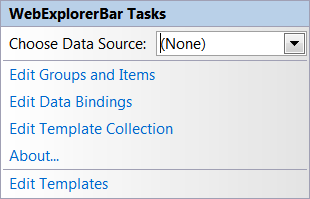

////

|metadata|
{
    "name": "webexplorerbar-smart-tag",
    "controlName": ["WebExplorerBar"],
    "tags": ["Design Environment","How Do I"],
    "guid": "{6142D276-0FDA-4134-A059-B6A53EA042ED}",  
    "buildFlags": [],
    "createdOn": "2010-01-03T22:47:22Z"
}
|metadata|
////

= WebExplorerBar Smart Tag

In Visual Studio 2005/2008 (.NET Framework 2.0/3.5), each Infragistics ASP.NET control/component is equipped with a Smart Tag. By selecting the control/component, a Smart Tag anchor appears. When you click this anchor, a pop-up panel appears, providing you with quick and easy access to the most common properties and settings of the control/component.

The WebExplorerBar™ Smart Tag contains the following items:

* Choose Data Source -- Allows you to choose an existing data source or configure a data source to bind to WebExplorerBar.

The WebExplorerBar Smart Tag contains the following links:

* Edit Groups and Items -- Brings up the Edit WebExplorerBar dialog for adding and removing groups and items as well as setting their properties.
* Edit DataBindings -- Brings up the Edit WebExplorerBar dialog to manage the data bindings of the control.
* Edit Template Collection -- Links to the template collection editor to add/remove templates that you can use in WebExplorerBar.
* About -- Clicking this opens the WebExplorerBar product information. It contains information such as Status, Version, Expiration and Product Key.
* Edit Templates -- Clicking this brings up all the available templates you can edit. You can drag and drop controls onto the templates and edit them as you like.

See the table below for a description of the item, as well as the item's corresponding property in the properties grid.

[options="header", cols="a,a,a"]
|====
|Items|Description|CorrespondingProperty

|Choose Data Source
|The drop-down list allows you to select an existing data source or configure a new data source.
|*DataSourceID*

|====

link:webexplorerbar-keyboard-navigation.html[Keyboard Navigation]

link:webexplorerbar-display-modes.html[Display Modes]

link:webexplorerbar-height-properties.html[WebExplorerBar Height Properties]

link:webexplorerbar-setting-navigateurl-and-target-properties.html[Setting NavigateURL and Target Properties]

link:webexplorerbar-binding-to-an-xml-data-source.html[Binding to an XML Data Source]

link:webexplorerbar-binding-to-webhierarchcialdatasource.html[Binding to WebHierarchcialDataSource]

link:webexplorerbar-serverevents.html[Server-Side Events]

link:webexplorerbar-selection-behavior.html[Selection Behavior]

link:webexplorerbar-clientside-api.html[ClientSide API]

link:webexplorerbar-clientevents.html[Client-Side Events]

link:webexplorerbar-styling.html[CSS Class Properties]