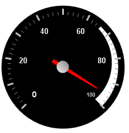

////

|metadata|
{
    "name": "webgauge-about-gauge-ranges",
    "controlName": ["WebGauge"],
    "tags": [],
    "guid": "{B5C54CDA-480E-41CD-9EBB-173151EF2979}",  
    "buildFlags": [],
    "createdOn": "0001-01-01T00:00:00Z"
}
|metadata|
////

= About Gauge Ranges

The  pick:[asp-net="link:infragistics4.webui.ultrawebgauge.v{ProductVersion}~infragistics.ultragauge.resources.gaugerange.html[Range]"]  property of the WebGauge control is a visual element that begins and ends at specified values on a scale. The Range property allows you to highlight specific parts of the scale. For example, on a vehicle tachometer, the high RPM zones, which are usually yellow and red, indicate that the engine is running higher than the optimal load.

== Related Topic

link:webgauge-add-a-range-to-a-gauge.html[Add Ranges to a Gauge]