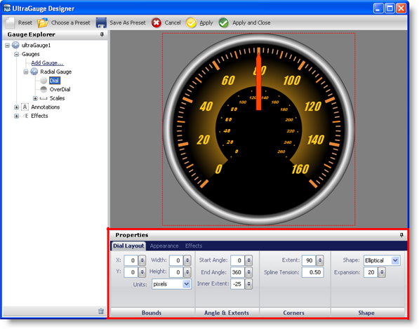

////

|metadata|
{
    "name": "webgauge-about-properties-panel",
    "controlName": ["WebGauge"],
    "tags": ["How Do I"],
    "guid": "{2E23EFFE-863F-4B57-8DDF-F1020BDE9D18}",  
    "buildFlags": [],
    "createdOn": "0001-01-01T00:00:00Z"
}
|metadata|
////

= About Properties Panel

When you select different gauges or properties of the gauge from either the Gauge Explorer or the interactive preview area, the Properties panel changes its content.

Using the Properties panel, you can edit the properties of your gauge and instantly see the changes in the interactive preview area, simplifying the editing process. For example, if you select a complicated gauge with many different properties from the predefined gauges, you can easily change the  pick:[asp-net="link:{ApiPlatform}webui.ultrawebgauge{ApiVersion}~infragistics.ultragauge.resources.radialgaugescale~labels.html[Label]"]  values through the Properties panels.

The following screen shot shows an example of the properties of a Radial gauge being displayed in the Properties panel.

