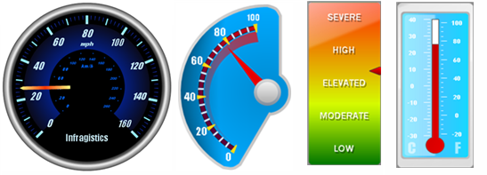

////

|metadata|
{
    "name": "webgauge-about-webgauge2",
    "controlName": ["WebGauge"],
    "tags": ["How Do I"],
    "guid": "{C6D3A7C5-0862-4B65-BDDA-9C3BA3C87990}",  
    "buildFlags": [],
    "createdOn": "0001-01-01T00:00:00Z"
}
|metadata|
////

= About WebGauge

The WebGauge control graphically depicts one or more data values within a range of values using needles and markers. The control is commonly used in dashboard-style user interfaces found in enterprise and industrial applications. You can consider the Gauge control itself as a surface that can host one or more individual gauges. Gauges can be arranged in any fashion to achieve the most complex series of readouts.

Gauge supports the following features:

* Gauges Collection – One or many Gauges can be added to Gauge, and arranged in any pattern.
* Gauge Types – Select from LinearGauge, RadialGauge and DigitalGauge types.
* Brush Elements – The various rendered graphical elements can be highly customized by leveraging the BrushElement property.
* Tickmarks – Show graphical “ticks” at varying frequencies to represent values within a given range.
* Labels – Show individual values at varying frequencies within the given range.
* Markers – Indicate the current value by utilizing a Needle or Bar marker.
* Annotations – Annotate any point within Gauge with a Box or Ellipse.

== Related Topics

link:webgauge-webgauge-types.html[WebGauge Types]

link:webgauge-webgauge-designer.html[WebGauge Designer]

link:webgauge-getting-started-with-webgauge.html[Getting Started with WebGauge]

link:webgauge-using-webgauge.html[Using WebGauge]

link:webgauge-deploying-webgauge.html[Deploying WebGauge]