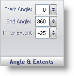

////

|metadata|
{
    "name": "webgauge-angle-and-extents-pane",
    "controlName": ["WebGauge"],
    "tags": ["How Do I"],
    "guid": "{27B51978-060E-42C0-8A6C-E3D89FD506FA}",  
    "buildFlags": [],
    "createdOn": "0001-01-01T00:00:00Z"
}
|metadata|
////

= Angle & Extents Pane

The Angle & Extents pane determines the shape of the  pick:[asp-net="link:infragistics4.webui.ultrawebgauge.v{ProductVersion}~infragistics.ultragauge.resources.radialgauge~dial.html[Dial]"]  property on your Radial gauge. A circular dial has a start angle of 0 and an end angle of 360.

pick:[asp-net="link:infragistics4.webui.ultrawebgauge.v{ProductVersion}~infragistics.ultragauge.resources.dialappearance~startangle.html[Start Angle]"]  -- Set the value to an integer from 0 to 360. The start angle is the start point of the dial and rotates in a clockwise direction.

pick:[asp-net="link:infragistics4.webui.ultrawebgauge.v{ProductVersion}~infragistics.ultragauge.resources.dialappearance~endangle.html[End Angle]"]  -- Set the value to an integer from 0 to 360. The end angle is the end point of the dial and rotates in a counter-clockwise direction from 360.

pick:[asp-net="link:infragistics4.webui.ultrawebgauge.v{ProductVersion}~infragistics.ultragauge.resources.dialappearance~innerextent.html[Inner Extent]"]  -- Set the value to a value from -360 to 360. A positive value displays an inner dial. A negative value displays an outer dial that you can see only if the end angle value is less than 360.

== Related Topic

link:webgauge-dial-layout-tab.html[Dial Layout Tab]