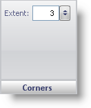

////

|metadata|
{
    "name": "webgauge-annotations-corners-pane",
    "controlName": ["WebGauge"],
    "tags": ["How Do I"],
    "guid": "{1B0F3226-6B84-4896-99E4-1CEE7FB6FA33}",  
    "buildFlags": [],
    "createdOn": "0001-01-01T00:00:00Z"
}
|metadata|
////

= Corners Pane

The Corners pane is used to determine the shape of the corners on your annotation.

pick:[asp-net="link:infragistics4.webui.ultrawebgauge.v{ProductVersion}~infragistics.ultragauge.resources.boxannotation~cornerextent.html[Extent]"]  -- Set this value to an integer from 0 to 100. The extent value determines the roundness of the corners on your annotation.

== Related Topic

link:webgauge-annotations-tab.html[Annotations Tab]