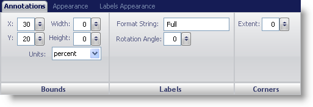
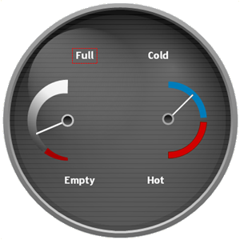

////

|metadata|
{
    "name": "webgauge-annotations-tab",
    "controlName": ["WebGauge"],
    "tags": ["How Do I"],
    "guid": "{911B084A-7B11-43E2-BEE8-B8A9662BCF9F}",  
    "buildFlags": [],
    "createdOn": "0001-01-01T00:00:00Z"
}
|metadata|
////

= Annotations Tab

The  pick:[asp-net="link:infragistics4.webui.ultrawebgauge.v{ProductVersion}~infragistics.ultragauge.resources.gaugeannotation.html[Annotations]"]  property of the WebGauge control is used to add extra information or to provide a visual cue to your gauge.

You can style an annotation using the Annotations tab of the Properties panel. To access this tab, you can either click Annotation in the Gauge Explorer or click on an annotation on your gauge in the interactive preview area.

The tab is divided into three panes:

* link:webgauge-bounds-pane.html[Bounds]
* link:webgauge-labels-pane.html[Labels]
* link:webgauge-corners-pane.html[Corners]

The following screen shot shows an annotation that was created according to the settings specified in the above screen shot.

