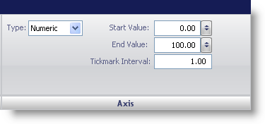

////

|metadata|
{
    "name": "webgauge-axis-pane",
    "controlName": ["WebGauge"],
    "tags": ["How Do I"],
    "guid": "{719B5EF2-6324-4054-B0E2-1D4F4EA7B777}",  
    "buildFlags": [],
    "createdOn": "0001-01-01T00:00:00Z"
}
|metadata|
////

= Axis Pane

The Axis pane allows you to set the values for the axis of the Scale property.

pick:[asp-net="link:{ApiPlatform}webui.ultrawebgauge{ApiVersion}~infragistics.ultragauge.resources.numericaxis.html[Type]"]  -- Set the axis to one of the following types:

* Numeric -- Sets the value of the axis to numeric.
* Time -- Sets the value of the the axis to a date format and the tick mark interval will be a time span.
* None -- Indicates that no axis has been set.

pick:[asp-net="link:{ApiPlatform}webui.ultrawebgauge{ApiVersion}~infragistics.ultragauge.resources.numericaxis~startvalue.html[Start Value]"]  -- Set the value to an integer from 0 to 360. This value determines the start value of the scale.

pick:[asp-net="link:{ApiPlatform}webui.ultrawebgauge{ApiVersion}~infragistics.ultragauge.resources.numericaxis~endvalue.html[End Value]"]  -- Set the value to an integer from 0 to 360. This value determines the end value of the scale.

pick:[asp-net="link:{ApiPlatform}webui.ultrawebgauge{ApiVersion}~infragistics.ultragauge.resources.numericaxis~tickmarkinterval.html[Tickmark Interval]"]  -- Set the value to an integer from 0 to 100. This value determines the frequency of each major tick mark displayed on the scale.

== Related Topic

link:webgauge-scale-layout-tab.html[Scale Layout Tab]