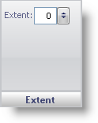

////

|metadata|
{
    "name": "webgauge-back-anchor-extent-pane",
    "controlName": ["WebGauge"],
    "tags": ["How Do I"],
    "guid": "{9A51A179-A81D-4E7C-A159-CD2469FF43D5}",  
    "buildFlags": [],
    "createdOn": "0001-01-01T00:00:00Z"
}
|metadata|
////

= Extent Pane

The Extent pane lets you determine the position of the back anchor.

pick:[asp-net="link:{ApiPlatform}webui.ultrawebgauge{ApiVersion}~infragistics.ultragauge.resources.radialgaugeneedleanchor~extent.html[Extent]"]  -- Set this value to an integer from 0 to 100. If the extent is set to 0, the back anchor will be positioned in the center of the Radial gauge. As the value increases the back anchor will move towards the edge of the gauge in the direction of the needle. As the value decreases the back anchor will move in the opposite direction. If you enter a value greater than 100, the back anchor will not appear on the gauge.

== Related Topic

link:webgauge-back-anchor-layout-tab.html[Back Anchor Layout Tab]