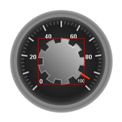

////

|metadata|
{
    "name": "webgauge-back-anchor-spoke-pane",
    "controlName": ["WebGauge"],
    "tags": ["How Do I"],
    "guid": "{E81C016F-86DD-4A6B-9848-C05A7C3991A9}",  
    "buildFlags": [],
    "createdOn": "0001-01-01T00:00:00Z"
}
|metadata|
////

= Spoke Pane

The Spoke pane is used to edit the shape of the back anchor. A depth value of 100 and a sweep value of 360 is circle. As the values decrease, the spokes become more visible.

pick:[asp-net="link:infragistics4.webui.ultrawebgauge.v{ProductVersion}~infragistics.ultragauge.resources.radialgaugeneedleanchor~spokedepth.html[Depth]"]  -- Set this value to an integer from 0 to 100. This value is the distance between each spoke and the center of your Radial gauge.

pick:[asp-net="link:infragistics4.webui.ultrawebgauge.v{ProductVersion}~infragistics.ultragauge.resources.radialgaugeneedleanchor~spokesweep.html[Sweep]"]  -- Set this value to an integer from 0 to 360. This value is the angular measurement of each spoke. The "spoke" appearance of the back anchor is visible only when the sweep value is less than 100.

image::images/Spoke_Pane_01.png[The back anchor s pane in the gauge designer.]

The following screen shot shows a back anchor and an anchor with the radius value set to 45, the depth value set to 80 and the sweep value set to 20.

== Related Topic

link:webgauge-back-anchor-layout-tab.html[Back Anchor Layout Tab]