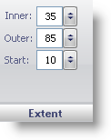

////

|metadata|
{
    "name": "webgauge-bar-marker-extent-pane",
    "controlName": ["WebGauge"],
    "tags": ["How Do I"],
    "guid": "{F6A05F9D-3671-4CBA-9C51-BDA6F8229EF0}",  
    "buildFlags": [],
    "createdOn": "0001-01-01T00:00:00Z"
}
|metadata|
////

= Extent Pane

The Extent pane determines the width of the bar marker.

pick:[asp-net="link:infragistics4.webui.ultrawebgauge.v{ProductVersion}~infragistics.ultragauge.resources.lineargaugebarmarker~innerextent.html[Inner]"]  -- Set this value to an integer from 0 to 100. The inner value is the distance from the left side of the Linear gauge to the start of the bar.

pick:[asp-net="link:infragistics4.webui.ultrawebgauge.v{ProductVersion}~infragistics.ultragauge.resources.lineargaugebarmarker~outerextent.html[Outer]"]  -- Set this value to an integer from 0 to 100. The outer value is the distance from the left side of the Linear gauge to the end of the bar.

pick:[asp-net="link:infragistics4.webui.ultrawebgauge.v{ProductVersion}~infragistics.ultragauge.resources.lineargaugebarmarker~startextent.html[Start]"]  -- Set this value to an integer from 0 to 100. The start value is the starting value for the bar marker.

== Related Topic

link:webgauge-bar-marker-layout-tab.html[Bar Marker Layout Tab]