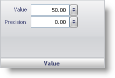

////

|metadata|
{
    "name": "webgauge-bar-marker-value-pane",
    "controlName": ["WebGauge"],
    "tags": ["How Do I"],
    "guid": "{15643342-5D20-47A3-A71C-98DFFF7A3212}",  
    "buildFlags": [],
    "createdOn": "0001-01-01T00:00:00Z"
}
|metadata|
////

= Value Pane

The Value pane lets you set the value at which the bar stops on the scale. It also lets you specify the "rounding" number for the marker.

Value -- Set this value to a value from 0.00 to 100.00. The value is the point on the scale that the bar stops at.

Precision -- Set this value to a value from 0.00 to 100.00. This value is the "rounding" number for the marker. For example, if the precision value is set to 0.5, the bar value will always snap to multiples of 0.5.

== Related Topic

link:webgauge-bar-marker-layout-tab.html[Bar Marker Layout Tab]