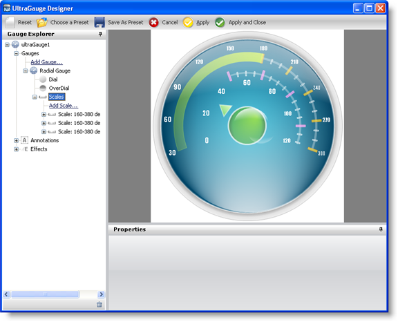

////

|metadata|
{
    "name": "webgauge-creating-a-complex-webgauge-using-the-webgauge-designer-part-3-of-5",
    "controlName": ["WebGauge"],
    "tags": ["Design Environment","How Do I"],
    "guid": "{8099E358-F6F8-4864-90BB-5F052672174F}",  
    "buildFlags": [],
    "createdOn": "0001-01-01T00:00:00Z"
}
|metadata|
////

= Creating a Complex WebGauge Using the WebGauge Designer (Part 3 of 5)

This topic is a continuation of link:webgauge-creating-a-complex-webgauge-using-the-webgauge-designer-part-2-of-5.html[Creating a Complex WebGauge Using the WebGauge Designer (Part 2 of 5)]. This procedure guides you through the process of adding a new scale, labels, tick marks, and a range to the existing Radial gauge.

[start=1]
. In the Gauge Explorer, expand Scales.
[start=2]
. Click Add Scale... and select New Scale.
[start=3]
. In the Properties panel, click the link:webgauge-scale-layout-tab.html[Scale Layout tab]. In the link:webgauge-sweep-angle-pane.html[Sweep Angle pane], set the following properties:

** Start -- 160
** End -- 380

[start=4]
. In the link:webgauge-axis-pane.html[Axis pane] of the Scale Layout tab, set the following properties:

** End Value -- 120.00
** Start Value -- 0.00
** Tickmark Interval -- 1.0

[start=5]
. In the Gauge Explorer, expand the newly created scale, and select Labels.
[start=6]
. In the Properties panel, click the link:webgauge-labels-layout-tab.html[Labels Layout tab]. In the link:webgauge-orientation-pane.html[Orientation pane], set the following properties:

** Extent -- 45
** Orientation -- Horizontal

[start=7]
. In the link:webgauge-formatting-pane.html[Formatting pane] of the Labels Layout tab, set the following properties:

** Frequency -- 20.00
** Span Max -- 10

[start=8]
. Click the link:webgauge-labels-appearance-tab.html[Labels Appearance tab]. In the link:webgauge-brush-pane.html[Brush pane] set the following properties:

** Type -- Solid
** Color -- White

[start=9]
. In the link:webgauge-font-pane.html[Font pane] of the Labels Appearance tab, set the following properties:

** Font -- Impact
** Font size -- 14
** Type -- Point

image::images/Gauge_Creating_a_Complex_Gauge_Walkthrough_Using_the_Gauge_Designer_07.png[The gauge designer with a radial gauge showing a second set of labels applied.]

[start=10]
. In the Gauge Explorer, select Major Tickmarks.
[start=11]
. In the Properties panel, click the link:webgauge-tickmark-layout-tab.html[Tickmark Layout tab]. In the link:webgauge-tickmark-extent-pane.html[Extent pane] set the following properties:

** Start -- 51
** End -- 61

[start=12]
. In the link:webgauge-widths-pane.html[Widths pane] of the Tickmark Layout tab, set the following properties:

** Start -- 4
** End -- 4

[start=13]
. In the link:webgauge-tickmark-orientation-pane.html[Orientation pane] of the Tickmark Layout tab, set the following property:

** Frequency -- 20.00
** Post-Initial -- 49

[start=14]
. Click the Appearance tab. In the Brush pane, set the following properties:

** Type -- Solid
** Color -- Color.FromArgb(180, 255, 158, 255)

[start=15]
. In the link:webgauge-stroke-pane.html[Stroke pane] of the Appearance tab, set the following properties:

** Type -- Solid
** Color -- Color.FromArgb(255, 135, 215)

[start=16]
. In the Gauge Explorer, select Minor Tickmarks.
[start=17]
. In the Properties Panel, click the Tickmark Layout tab. In the Extent pane, set the following properties:

** Start -- 53
** End -- 58

[start=18]
. In the Widths pane of the Tickmark Layout tab, set the following properties:

** Start -- 2
** End -- 2

[start=19]
. In the Orientation pane of the Tickmark Layout tab, set the following properties:

** Post-Initial -- 49
** Frequency -- 5.00

[start=20]
. Click the Appearance tab. In the Brush pane, set the following properties:

** Type -- Solid
** Color -- Color.FromArgb(0, 255, 255, 255)

[start=21]
. In the Stroke pane of the Appearance tab, set the following properties:

** Type -- Solid
** Color -- White

[start=22]
. In the Gauge Explorer, expand Ranges.
[start=23]
. Click Add Range... and select New Range.
[start=24]
. In the link:webgauge-value-pane.html[Value pane] of the link:webgauge-range-layout-tab.html[Range Layout tab], set the following properties:

** Start -- 50.00
** End -- 120.00

[start=25]
. In the link:webgauge-extent-pane.html[Extent pane] of the Range Layout tab, set the following properties:

** Inner Start -- 55
** Inner End -- 55
** Outer -- 57

[start=26]
. In the Properties panel, click the Appearance tab. In the Brush pane, set the following properties:

** Type -- Solid
** Color -- Color.FromArgb(80, 255, 255, 255)
** Thickness -- 1

== Related Topic

link:webgauge-creating-a-complex-webgauge-using-the-webgauge-designer-part-4-of-5.html[Creating a Complex WebGauge Using the WebGauge Designer (Part 4 of 5)]