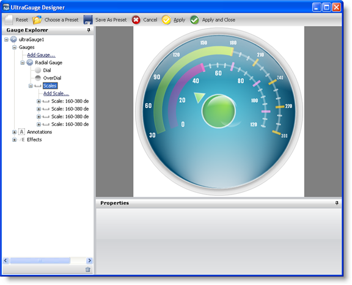

////

|metadata|
{
    "name": "webgauge-creating-a-complex-webgauge-using-the-webgauge-designer-part-4-of-5",
    "controlName": ["WebGauge"],
    "tags": [],
    "guid": "{9F3EEE57-49DF-4387-BC0A-3CDF7D20B0ED}",  
    "buildFlags": [],
    "createdOn": "0001-01-01T00:00:00Z"
}
|metadata|
////

= Creating a Complex WebGauge Using the WebGauge Designer (Part 4 of 5)

This topic is a continuation of link:webgauge-creating-a-complex-webgauge-using-the-webgauge-designer-part-3-of-5.html[Creating a Complex WebGauge Using the WebGauge Designer (Part 3 of 5)]. This procedure guides you through the process of adding a new scale and range to the existing Radial gauge.

[start=1]
. In the Gauge Explorer, expand Scales.
[start=2]
. Click Add Scale... and select New Scale.
[start=3]
. In the Properties panel, click the link:webgauge-scale-layout-tab.html[Scale Layout tab]. In the link:webgauge-sweep-angle-pane.html[Sweep Angle pane], set the following properties:

** Start -- 160
** End -- 380

[start=4]
. In the link:webgauge-axis-pane.html[Axis pane] of the Scale Layout tab, set the following properties:

** End Value -- 120.00
** Start Value -- 0.00
** Tickmark Interval -- 1.0

[start=5]
. In the Gauge Explorer, expand Ranges.
[start=6]
. Click Add Range... and select New Range.
[start=7]
. In the Value pane of the Range Layout tab, set the following properties:

** Start -- 0.00
** End -- 50.00

[start=8]
. In the Extent pane of the Range Layout tab, set the following properties:

** Inner Start -- 51
** Inner End -- 51
** Outer -- 61

[start=9]
. Click the Appearance tab. In the Brush pane, add the following brush elements with the specified properties:

** link:webgauge-simple-gradient-brush-element.html[Simple Gradient brush element]

*** StartColor -- Color = Color.FromArgb(232, 0, 154)
*** EndColor -- Color = Transparent
*** Gradient Style -- BackwardDiagonal

== Related Topic

link:webgauge-creating-a-complex-webgauge-using-the-webgauge-designer-part-5-of-5.html[Creating a Complex WebGauge Using the WebGauge Designer (Part 5 of 5)]