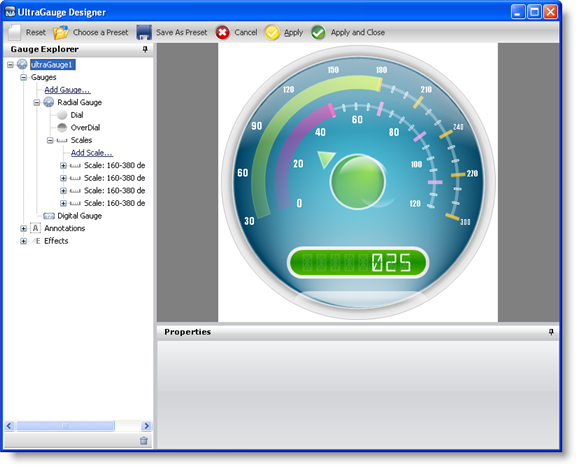

////

|metadata|
{
    "name": "webgauge-creating-a-complex-webgauge-using-the-webgauge-designer-part-5-of-5",
    "controlName": ["WebGauge"],
    "tags": ["Design Environment","How Do I"],
    "guid": "{4D04E39A-AA02-4A20-9F62-76A554862501}",  
    "buildFlags": [],
    "createdOn": "0001-01-01T00:00:00Z"
}
|metadata|
////

= Creating a Complex WebGauge Using the WebGauge Designer (Part 5 of 5)

This topic is a continuation of link:webgauge-creating-a-complex-webgauge-using-the-webgauge-designer-part-4-of-5.html[Creating a Complex WebGauge Using the WebGauge Designer (Part 4 of 5)]. This procedure guides you through the process of adding a Digital gauge to the existing Radial gauge.

[start=1]
. In the Gauge Explorer, expand Gauges.
[start=2]
. Click Add Gauge... and select New Digital Gauge.
[start=3]
. In the Properties panel, click the link:webgauge-digital-gauge.html[Gauge Layout tab]. In the link:webgauge-bounds-pane.html[Bounds pane], set the following properties:

** X -- 0
** Y -- 70
** Width -- 100
** Height -- 18
** Units -- Percent

[start=4]
. In the link:webgauge-margin-pane.html[Margin pane] of the Gauge Layout tab, set the following properties:

** Top -- 15
** Bottom -- 15
** Left -- 100
** Right -- 100
** Units -- Pixels

[start=5]
. In the link:webgauge-digital-misc-pane.html[Misc pane] of the Gauge Layout tab, set the following properties:

** Mode -- FourteenSegment
** Text -- 025
** Extent -- 48
** Digits -- 8
** Digit Spacing -- 6

[start=6]
. In the Properties panel, click the link:webgauge-appearance-tab.html[Appearance tab]. In the link:webgauge-brush-pane.html[Brush pane], add the following brush elements with the specified properties:

** link:webgauge-multi-stop-linear-gradient-brush-element.html[Multi-Stop Linear Gradient brush element]

*** ColorStop 1 -- Offset = 0, Color = Color.FromArgb(93, 186, 0)
*** ColorStop 2 -- Offset = 0.5, Color = Color.FromArgb(23, 141, 0)
*** ColorStop 3 -- Offset = 1, Color = Color.FromArgb(93, 186, 0)
*** Angle -- 90

** Multi-Stop Linear Gradient brush element

*** ColorStop 1 -- Offset = 0, Color = Color.FromArgb(150, 255, 255, 255)
*** ColorStop 2 -- Offset = 0.2586207, Color = Color.FromArgb(125, 255, 255, 255)
*** ColorStop 3 -- Offset = 0.5103447, Color = Transparent
*** ColorStop 4 -- Offset = 1, Color = Transparent
*** Angle -- 90

[start=7]
. In the link:webgauge-stroke-pane.html[Stroke pane] of the Appearance tab, set the following properties:

** Simple Gradient brush element

*** StartColor -- WhiteSmoke
*** EndColor -- Gainsboro
*** Gradient Style -- Backward Diagonal

** Thickness -- 5

[start=8]
. Click the link:webgauge-digit-appearance-tab.html[Digit Appearance tab]. In the link:webgauge-font-brush-pane.html[Font Brush pane], set the following properties:

** Type -- Solid
** Color -- Color.FromArgb(255, 255, 255)

[start=9]
. In the link:webgauge-unlit-brush-pane.html[Unlit Brush pane] of the Digit Appearance tab, set the following properties:

** Type -- Solid
** Color -- Color.FromArgb(30, 255, 255, 255)

