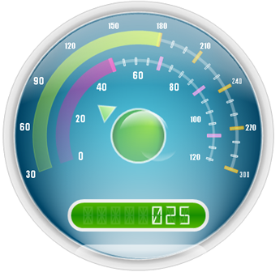

////

|metadata|
{
    "name": "webgauge-creating-a-complex-webgauge-using-the-webgauge-designer",
    "controlName": ["WebGauge"],
    "tags": ["How Do I"],
    "guid": "{30B4CF14-5010-4C42-A027-9494AF2072E6}",  
    "buildFlags": [],
    "createdOn": "0001-01-01T00:00:00Z"
}
|metadata|
////

= Creating a Complex WebGauge Using the WebGauge Designer

You can use the link:webgauge-webgauge-designer.html[Gauge Designer] to create complex gauges that can consist of multiple gauges containing multiple scales, ranges and markers.

The following topics comprise of a multi-part walkthrough that guides you through the process of creating a complex Radial gauge containing a Digital gauge using the Designer:

* link:webgauge-creating-a-complex-webgauge-using-the-webgauge-designer-part-1-of-5.html[Creating a Complex WebGauge Using the WebGauge Designer (Part 1 of 5)]
* link:webgauge-creating-a-complex-webgauge-using-the-webgauge-designer-part-2-of-5.html[Creating a Complex WebGauge Using the WebGauge Designer (Part 2 of 5)]
* link:webgauge-creating-a-complex-webgauge-using-the-webgauge-designer-part-3-of-5.html[Creating a Complex WebGauge Using the WebGauge Designer (Part 3 of 5)]
* link:webgauge-creating-a-complex-webgauge-using-the-webgauge-designer-part-4-of-5.html[Creating a Complex WebGauge Using the WebGauge Designer (Part 4 of 5)]
* link:webgauge-creating-a-complex-webgauge-using-the-webgauge-designer-part-5-of-5.html[Creating a Complex WebGauge Using the WebGauge Designer (Part 5 of 5)]

At the end of the multi-part walkthrough, you will have created a gauge similar to the screen shot below.

