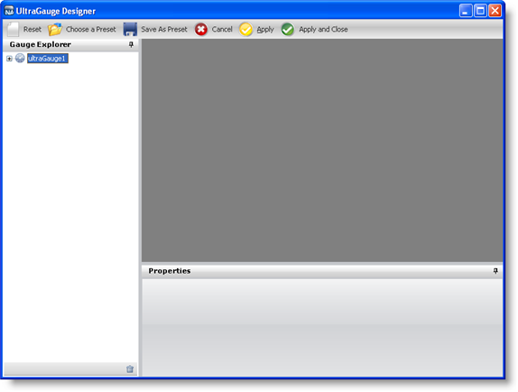
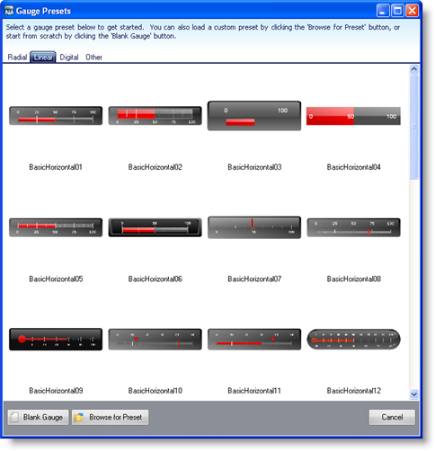
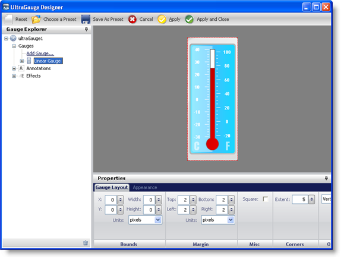
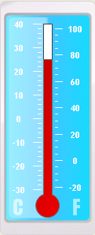

////

|metadata|
{
    "name": "webgauge-creating-a-linear-webgauge-using-the-webgauge-presets",
    "controlName": ["WebGauge"],
    "tags": ["How Do I"],
    "guid": "{6CE2DE3D-68D3-4DD2-990F-A106BCD4D5AB}",  
    "buildFlags": [],
    "createdOn": "0001-01-01T00:00:00Z"
}
|metadata|
////

= Creating a Linear WebGauge Using the WebGauge Presets

== Before You Begin

Creating Linear gauges with the Gauge Designer simplifies the process of creating Linear gauges as you can use predefined presets.

== What You Will Accomplish

Using the Gauge Designer to create Linear gauges will help you create visually appealing and professional-looking gauges such as thermometers.

== Follow these Steps

[start=1]
. From the toolbox, drag the UltraGauge control to your form. The Gauge Designer opens.

[start=2]
. On the Toolbar, click Open Presets.
[start=3]
. Click the Linear tab.

[start=4]
. Select a predefined Linear gauge. When you select a gauge it appears in the interactive preview area.

[start=5]
. To create a Linear gauge using the selected preset without closing the Gauge Designer, click Apply. To create a Linear gauge using the selected preset and automatically close the designer, click Apply and Close.
[start=6]
. Run the application. It should look similar to the form below.

