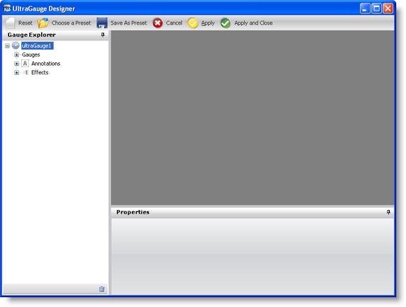
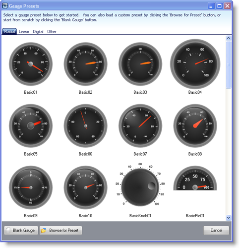
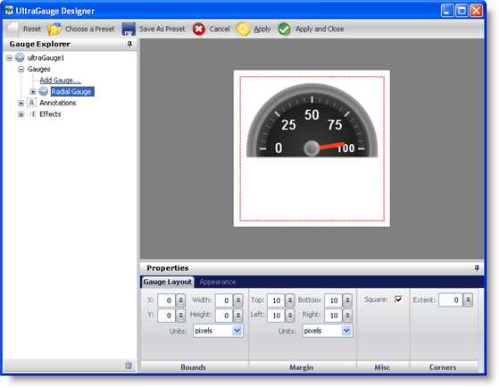
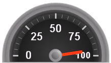

////

|metadata|
{
    "name": "webgauge-creating-a-radial-webgauge-using-the-webgauge-presets",
    "controlName": ["WebGauge"],
    "tags": ["How Do I"],
    "guid": "{9B04AF03-0FB4-44EA-8A3B-74790BD7882E}",  
    "buildFlags": [],
    "createdOn": "0001-01-01T00:00:00Z"
}
|metadata|
////

= Creating a Radial WebGauge Using the WebGauge Presets

== Before You Begin

Creating a Radial gauge using the Gauge Designer allows you to use predefined presets, therefore eliminating a lot of the work required to create Radial gauges.

== What You Will Accomplish

Using the Gauge Designer to create Radial gauges will help you create visually appealing and professional-looking gauges such as speedometers.

== Follow these Steps

[start=1]
. From the toolbox, drag the UltraGauge control to your form. The Gauge Designer opens.

[start=2]
. On the Toolbar, click Open Presets.
[start=3]
. Click the Radial tab.

[start=4]
. Select a predefined Radial gauge. When you select a gauge it appears in the interactive preview area.

[start=5]
. To create a Radial gauge using the selected preset without closing the Gauge Designer, click Apply. To create a Radial gauge using the selected preset and automatically close the designer, click Apply and Close.
[start=6]
. Run the application. It should look similar to the form below.

