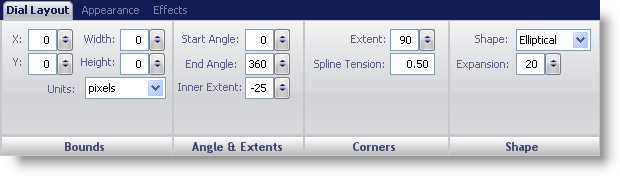
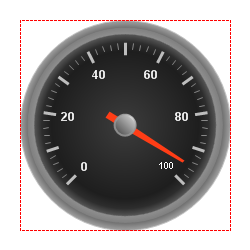

////

|metadata|
{
    "name": "webgauge-dial-layout-tab",
    "controlName": ["WebGauge"],
    "tags": ["How Do I"],
    "guid": "{0D42A94F-61CD-459F-8315-AB6736630D65}",  
    "buildFlags": [],
    "createdOn": "0001-01-01T00:00:00Z"
}
|metadata|
////

= Dial Layout Tab

The  pick:[asp-net="link:infragistics4.webui.ultrawebgauge.v{ProductVersion}~infragistics.ultragauge.resources.radialgauge~dial.html[Dial]"]  property determines the shape of a Radial gauge. By default, the dial sweeps 360 degrees, so it appears as a circle.

You can customize the dial on your gauge using the Dial Layout tab of the Properties panel. To access this tab, you can either click on Dial in the Gauge Explorer (Radial Gauge > Dial) or clicking on the dial of your Radial gauge in interactive preview area.

The tab is divided into four panes:

* link:webgauge-bounds-pane.html[Bounds]
* link:webgauge-angle-and-extents-pane.html[Angles & Extents]
* link:webgauge-corners-pane.html[Corners]
* link:webgauge-shape-pane.html[Shape]

The following screen shot shows a dial that was created according to the layout settings specified in the above screen shot.

