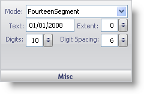

////

|metadata|
{
    "name": "webgauge-digital-misc-pane",
    "controlName": ["WebGauge"],
    "tags": ["How Do I"],
    "guid": "{B7E7DFA0-CD94-4CA2-8B18-C2A544BBDBC9}",  
    "buildFlags": [],
    "createdOn": "0001-01-01T00:00:00Z"
}
|metadata|
////

= Misc Pane

The Misc pane is used to set miscellaneous properties of your Digital gauge.

pick:[asp-net="link:infragistics4.webui.ultrawebgauge.v{ProductVersion}~infragistics.ultragauge.resources.segmenteddigitalgauge~mode.html[Mode]"]  -- The mode value specifies whether your Digital gauge should be represented as a seven- or 14- segment display. For more information on the Mode property, see link:webgauge-working-with-digital-webgauges.html[Working with Digital WebGauges.]

pick:[asp-net="link:infragistics4.webui.ultrawebgauge.v{ProductVersion}~infragistics.ultragauge.resources.digitalgauge~text.html[Text]"]  -- The text value represents the data that is displayed on your Digital gauge.

pick:[asp-net="link:infragistics4.webui.ultrawebgauge.v{ProductVersion}~infragistics.ultragauge.resources.gauge~cornerextent.html[Extent]"]  -- Set this value to an integer from 0 to 100. This value sets the roundness of the corners of your Digital gauge.

pick:[asp-net="link:infragistics4.webui.ultrawebgauge.v{ProductVersion}~infragistics.ultragauge.resources.digitalgauge~digits.html[Digits]"]  -- The digits value determines how many digits your gauge can display.

pick:[asp-net="link:infragistics4.webui.ultrawebgauge.v{ProductVersion}~infragistics.ultragauge.resources.digitalgauge~digitspacing.html[Digit Spacing]"]  -- This value sets the distance between each digit displayed on your gauge.

== Related Topic

link:webgauge-digital-webgauges.html[Digital WebGauges]