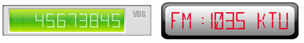

////

|metadata|
{
    "name": "webgauge-digital-webgauges",
    "controlName": ["WebGauge"],
    "tags": ["How Do I"],
    "guid": "{D2298424-248E-4B06-922E-81B0B8B0D66F}",  
    "buildFlags": [],
    "createdOn": "0001-01-01T00:00:00Z"
}
|metadata|
////

= Digital WebGauges

A Digital gauge represents values similar to a digital watch or digital alarm clock. Each digit within the value is rendered by arranging various “Sections”. A Digital gauge can be very useful to provide an odometer-like view to an existing gauge, or can be used just as well as a standalone.

Click the following link for information on working with Digital gauges:

* link:webgauge-working-with-digital-webgauges.html[Working with Digital WebGauges]