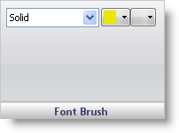

////

|metadata|
{
    "name": "webgauge-font-brush-pane",
    "controlName": ["WebGauge"],
    "tags": ["How Do I"],
    "guid": "{C1DADFA4-8A9E-405F-A331-B051F1780FF0}",  
    "buildFlags": [],
    "createdOn": "0001-01-01T00:00:00Z"
}
|metadata|
////

= Font Brush Pane

The Font Brush pane is used to customize the digits on your Digital gauge.

pick:[asp-net="link:{ApiPlatform}webui.ultrawebgauge{ApiVersion}~infragistics.ultragauge.resources.digitalgauge~fontbrushelement.html[Brush Type]"]  -- This drop-down list lets you change the brush type of the digits on your Digital gauge.

pick:[asp-net="link:{ApiPlatform}webui.ultrawebgauge{ApiVersion}~infragistics.ultragauge.resources.digitalgauge~fontbrushelement.html[Brush Color]"]  -- Depending on which brush type you select, the brush color list will populate with the colors available for that brush type.

Relative Bounds Editor -- This pop-up menu displays two bounds editors, link:webgauge-relative-bounds.html[Relative Bounds] and link:webgauge-relative-clip-bounds.html[Relative Clip Bounds], that allows you to determine the size and location of your brush element.

== Related Topic

link:webgauge-digit-appearance-tab.html[Digit Appearance Tab]