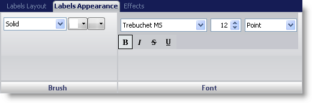
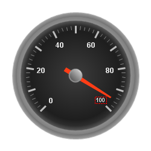

////

|metadata|
{
    "name": "webgauge-labels-appearance-tab",
    "controlName": ["WebGauge"],
    "tags": ["How Do I"],
    "guid": "{7EAF13D9-38D4-4934-8E08-3E87E710B9F7}",  
    "buildFlags": [],
    "createdOn": "0001-01-01T00:00:00Z"
}
|metadata|
////

= Labels Appearance Tab

The Labels Appearance tab is used to customize the labels on your gauge. You can access this tab by either clicking Labels in the Gauge Explorer (Radial\Linear Gauge > Scales> Labels) or by selecting a label on your gauge from the interactive preview area.

This tab is divided into two panes:

* link:webgauge-brush-pane.html[Brush]
* link:webgauge-font-pane.html[Font]

The following screen shot shows a label that was created according to the label appearance settings specified in the above screen shot.

