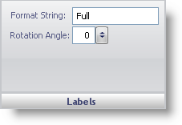

////

|metadata|
{
    "name": "webgauge-labels-pane",
    "controlName": ["WebGauge"],
    "tags": ["How Do I"],
    "guid": "{600DF436-3FAE-4634-A4CA-AECE880DFF95}",  
    "buildFlags": [],
    "createdOn": "0001-01-01T00:00:00Z"
}
|metadata|
////

= Labels Pane

The Labels pane lets you set the text and the rotation angle of the annotation on your gauge.

pick:[asp-net="link:{ApiPlatform}webui.ultrawebgauge{ApiVersion}~infragistics.ultragauge.resources.labelappearance~formatstring.html[Format String]"]  -- This value specifies the text of your annotation.

pick:[asp-net="link:{ApiPlatform}webui.ultrawebgauge{ApiVersion}~infragistics.ultragauge.resources.labelappearance~rotationangle.html[Rotation Angle]"]  -- Set this value to an integer from 0 to 100. This value sets the rotation angle of your annotation.

== Related Topic

link:webgauge-annotations-tab.html[Annotations Tab]