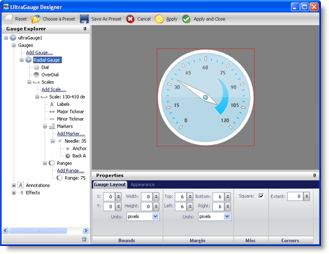

////

|metadata|
{
    "name": "webgauge-layout-of-the-webgauge-designer",
    "controlName": ["WebGauge"],
    "tags": ["Layouts"],
    "guid": "{BBA140E2-7456-47BE-BF34-C3DACA7DED89}",  
    "buildFlags": [],
    "createdOn": "0001-01-01T00:00:00Z"
}
|metadata|
////

= Layout of the WebGauge Designer

The Gauge Designer is essentially comprised of three main sections:

* link:webgauge-webgauge-explorer.html[WebGauge Explorer] -- This section is located on the left-hand side of the designer, and allows for easy navigation through the Gauge control.
* link:webgauge-properties-panel.html[Properties Panel] -- This section is located in the lower-right pane of the designer, and allows you to edit your gauge's properties.
* link:webgauge-interactive-preview-area.html[Interactive Preview Area] -- This section is located in the upper-right pane of the designer, and allows you to view the gauge, and dynamically view any changes you make to it.

The following screen shot displays the layout of the designer

