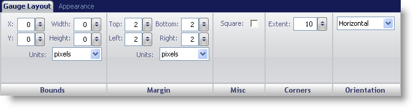
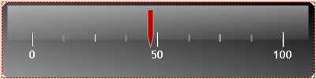

////

|metadata|
{
    "name": "webgauge-linear-gauge",
    "controlName": ["WebGauge"],
    "tags": ["How Do I"],
    "guid": "{C3DB26FE-3908-4D1D-BD22-657C0AD660AE}",  
    "buildFlags": [],
    "createdOn": "0001-01-01T00:00:00Z"
}
|metadata|
////

= Linear Gauge

A Linear gauge is often used to visually display data that increases/decreases; for example, temperature. You could create a vertically orientated Linear gauge to represent a thermometer.

You can edit the display of your Linear gauge using the Gauge Layout tab of the Properties panel. You can display this tab by either clicking Linear Gauge in the Gauge Explorer or clicking the Linear gauge in the interactive preview area.

The tab is divided into four panes:

* link:webgauge-bounds-pane.html[Bounds]
* link:webgauge-margin-pane.html[Margin]
* link:webgauge-corners-pane.html[Corners]
* link:webgauge-orientation-pane.html[Orientation]
* link:webgauge-linear-misc-pane.html[Misc]

The following screen shot shows a Linear gauge that was created according to the layout settings specified in the above screen shot.

Click the following link for information on working with Linear gauges:

* link:webgauge-working-with-linear-webgauges.html[Working with Linear WebGauges]