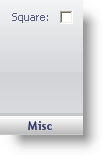

////

|metadata|
{
    "name": "webgauge-linear-misc-pane",
    "controlName": ["WebGauge"],
    "tags": ["How Do I"],
    "guid": "{C14FA05C-2FD8-401F-90A1-4AD826F974EA}",  
    "buildFlags": [],
    "createdOn": "0001-01-01T00:00:00Z"
}
|metadata|
////

= Misc Pane

The Misc pane is used so that a gauge can scale with a Radial gauge.

*Misc* -- Setting this value to True constrains the source bounds to a square, just like Radial gauges have always done by default so that they appear circular and not oblique. The default value for this property is false, except for radial gauges. So, if you have a gauge and you want it to scale properly with a Radial gauge which is underneath, set its Square property to true and its bounds will scale along with the Radial gauge (whose Square property is set to true by default).

== Related Topic

link:webgauge-linear-gauge.html[Linear Gauge]