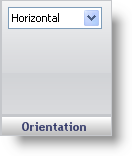

////

|metadata|
{
    "name": "webgauge-linear-orientation-pane",
    "controlName": ["WebGauge"],
    "tags": ["How Do I"],
    "guid": "{2EA2BD7C-2E95-4D2D-A3A0-B34F36B0F41A}",  
    "buildFlags": [],
    "createdOn": "0001-01-01T00:00:00Z"
}
|metadata|
////

= Orientation Pane

The Orientation pane is used to set the position of your Linear gauge on the WebGauge control.

Orientation -- This value specifies the position of your gauge. The orientation can be set to Horizontal or Vertical.

== Related Topic

link:webgauge-linear-gauge.html[Linear Gauge]