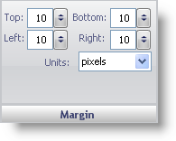

////

|metadata|
{
    "name": "webgauge-margin-pane",
    "controlName": ["WebGauge"],
    "tags": ["How Do I"],
    "guid": "{70273BA4-8EDE-4ABC-A11D-A29B9AF8FA33}",  
    "buildFlags": [],
    "createdOn": "0001-01-01T00:00:00Z"
}
|metadata|
////

= Margin Pane

The Margin pane is used to display the location of your gauge on the WebGauge control.

pick:[asp-net="link:infragistics4.webui.ultrawebgauge.v{ProductVersion}~infragistics.ultragauge.resources.gauge~margin.html[Top]"]  -- If you set the top value to exceed the height of the Gauge control or to be less than 0, your gauge may not appear on the Gauge control. The top value represents the size of the margin at the top of the Gauge control.

pick:[asp-net="link:infragistics4.webui.ultrawebgauge.v{ProductVersion}~infragistics.ultragauge.resources.gauge~margin.html[Bottom]"]  -- If you set the bottom value to exceed the height of the Gauge control or to be less than 0, your gauge may not appear on the Gauge control. The bottom value represents the size of the margin at the bottom of the Gauge control.

pick:[asp-net="link:infragistics4.webui.ultrawebgauge.v{ProductVersion}~infragistics.ultragauge.resources.gauge~margin.html[Left]"]  -- If you set the left value to exceed the width of the Gauge control or to be less than 0, your gauge may not appear on the Gauge control. The left value represents the size of the margin at the left side of the Gauge control.

pick:[asp-net="link:infragistics4.webui.ultrawebgauge.v{ProductVersion}~infragistics.ultragauge.resources.gauge~margin.html[Right]"]  -- If you set the right value to exceed the width of the Gauge control or to be less than 0, your gauge may not appear on the Gauge control. The right value represents the size of the margin at the right side of the Gauge control.

pick:[asp-net="link:infragistics4.webui.ultrawebgauge.v{ProductVersion}~infragistics.ultragauge.resources.gauge~margin.html[Units]"]  -- This value specifies the unit of measurement for the gauge. The gauge can be measured in pixels or as a percentage of the Gauge control.

== Related Topics

link:webgauge-digital-gauge.html[Digital Gauge]

link:webgauge-linear-gauge.html[Linear Gauge]

link:webgauge-radial-gauge.html[Radial Gauge]