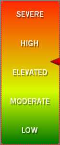

////

|metadata|
{
    "name": "webgauge-multi-stop-linear-gradient-brush-element",
    "controlName": ["WebGauge"],
    "tags": ["How Do I"],
    "guid": "{64093B19-36C4-4321-82AF-508693C5D5F1}",  
    "buildFlags": [],
    "createdOn": "0001-01-01T00:00:00Z"
}
|metadata|
////

= Multi Stop Linear Gradient Brush Element

If you want more than two colors to blend in a linear fashion on a property on your gauge, set the brush element to MultiStopLinearGradient. When you select the MultiStopLinearGradient brush element, you can specify more than two colors and the positional offsets for each color. You can apply the Multi-Stop Linear Gradient brush element to the properties on your gauge using:

* link:webgauge-apply-the-multi-stop-linear-gradient-brush-element-using-the-gauge-designer.html[the Gauge Designer]
* link:webgauge-apply-the-multi-stop-linear-gradient-brush-element-at-design-time.html[the Gauges collection editor]
* link:webgauge-apply-the-multi-stop-linear-gradient-brush-element-at-run-time.html[code]

The following screen shot shows a Linear gauge set to the following Multi-Stop Linear Gradient brush element settings:

* ColorStop 1: Offset = 0, Color = Color.FromArgb(254, 42, 0)
* ColorStop 2: Offset =0.637, Color=Color.FromArgb( 212, 254, 0)
* ColorStop 3: Offset = 1, Color = Color.FromArgb(0, 118, 0)
* Angle -- 90

