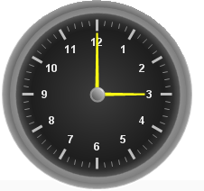

////

|metadata|
{
    "name": "webgauge-needle-marker",
    "controlName": ["WebGauge"],
    "tags": ["How Do I"],
    "guid": "{1D4FEE57-B2DF-4ABD-8493-47A0AD97C1E6}",  
    "buildFlags": [],
    "createdOn": "0001-01-01T00:00:00Z"
}
|metadata|
////

= Needle Marker

A needle marker is displayed as a pointer that points to a specific value on a scale.

For example, if you were creating a Radial gauge to represent a clock, you would use a needle marker to display the hands of the clock.

== Related Topic

link:webgauge-add-a-needle-marker-to-a-gauge.html[Add a Needle Marker to a Gauge]