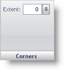

////

|metadata|
{
    "name": "webgauge-radial-gauge-corners-pane",
    "controlName": ["WebGauge"],
    "tags": ["How Do I"],
    "guid": "{3FFC72FB-CBEC-4697-ADDA-5BDEBD806FC4}",  
    "buildFlags": [],
    "createdOn": "0001-01-01T00:00:00Z"
}
|metadata|
////

= Corners Pane

The Corners pane is used to determine the shape of the corners on your Radial gauge.

pick:[asp-net="link:{ApiPlatform}webui.ultrawebgauge{ApiVersion}~infragistics.ultragauge.resources.gauge~cornerextent.html[Extent]"]  -- Set this value to an integer from 0 to 100. This value determines the roundness of the corners of your Radial gauge.

== Related Topic

link:webgauge-radial-gauge.html[Radial Gauge]