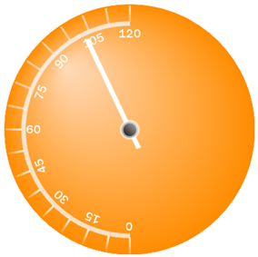

////

|metadata|
{
    "name": "webgauge-radial-gradient-brush-element",
    "controlName": ["WebGauge"],
    "tags": ["How Do I"],
    "guid": "{CD519B68-49CC-4035-BE57-E46EF55B5948}",  
    "buildFlags": [],
    "createdOn": "0001-01-01T00:00:00Z"
}
|metadata|
////

= Radial Gradient Brush Element

If you want two colors of a property on your gauge to blend into each other in circular way, set the brush type to RadialGradient. When you select the RadialGradient brush element, you can specify center and surround colors, as well as the center point and focus scales. You can apply the Radial Gradient brush element to the properties on your gauge using:

* link:webgauge-apply-the-radial-gradient-brush-element-using-the-gauge-designer.html[the Gauge Designer]
* link:webgauge-apply-the-radial-gradient-brush-element-at-design-time.html[the Gauges collection editor]
* link:webgauge-apply-the-radial-gradient-brush-element-at-run-time.html[code]

The following screen shot displays a Radial gauge with the Dial's BrushElement set to a RadialGradientBrushElement with the following settings:

* Center color -- Peach Puff
* Surround color -- Sandy Brown
* Center point -- 25, 25
* Focus point -- 0, 0
* Center point measure -- Percent

