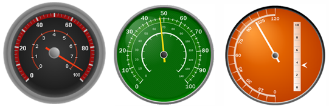

////

|metadata|
{
    "name": "webgauge-radial-webgauges",
    "controlName": ["WebGauge"],
    "tags": ["How Do I"],
    "guid": "{F0901E6B-7D59-4789-97C9-3A49D06D7896}",  
    "buildFlags": [],
    "createdOn": "0001-01-01T00:00:00Z"
}
|metadata|
////

= Radial WebGauges

A Radial gauge visualizes data in a circular fashion. Although a Radial gauge can also be square, the Needle and Bar markers that represent current values, rotate in a circular fashion (similar to the hands of a clock).

Typically, a Radial gauge can be designed to be a complete circle, half of a circle, or one-quarter of a circle. One or more sections can be added to represent the range of possible values. Markers that represent a specific value can then be added to point out where within the sections these values reside.

Click the following link for information on working with Radial gauges:

* link:webgauge-working-with-radial-webgauges.html[Working with Radial WebGauges]