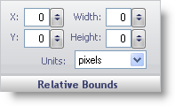

////

|metadata|
{
    "name": "webgauge-relative-bounds",
    "controlName": ["WebGauge"],
    "tags": ["How Do I"],
    "guid": "{D3FF4925-F78E-439E-8CE3-570A75946ACD}",  
    "buildFlags": [],
    "createdOn": "0001-01-01T00:00:00Z"
}
|metadata|
////

= Relative Bounds

The Relative Bounds pane determines the size and the location of the Brush element on your gauge.

X -- This value determines the distance of the brush element from the left of the Gauge control.

Y -- This value determines the distance of the brush element from the top of the Gauge control.

Width -- This value determines the width of your brush element.

Height -- This value determines the height of your brush element.

Units -- This value specifies the unit of measurement for your brush element. The brush element can be measured in pixels or as a percentage of the Gauge control.

== Related Topics

link:webgauge-appearance-tab.html[Appearance Tab]

link:webgauge-digit-appearance-tab.html[Digit Appearance Tab]

link:webgauge-labels-appearance-tab.html[Labels Appearance Tab]

link:webgauge-effects-tab.html[Effects Tab]