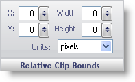

////

|metadata|
{
    "name": "webgauge-relative-clip-bounds",
    "controlName": ["WebGauge"],
    "tags": ["How Do I"],
    "guid": "{77C4712A-A9B5-4EE8-AD16-CC5AEA49BB6B}",  
    "buildFlags": [],
    "createdOn": "0001-01-01T00:00:00Z"
}
|metadata|
////

= Relative Clip Bounds

The Relative Clip Bounds pane determines the size and the location of a clip region for the Brush element on your gauge.

X -- This value determines the distance of the clip region of your brush element from the left of the Gauge control.

Y -- This value determines the distance of the clip region of your brush element from the top of the Gauge control.

Width -- This value determines the width of the clip region.

Height -- This value determines the height of the clip region.

Units -- This value specifies the unit of measurement for your clip region. The clip region can be measured in pixels or as a percentage of the Gauge control.

== Related Topics

link:webgauge-appearance-tab.html[Appearance Tab]

link:webgauge-digit-appearance-tab.html[Digit Appearance Tab]

link:webgauge-labels-appearance-tab.html[Labels Appearance Tab]

link:webgauge-effects-tab.html[Effects Tab]