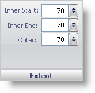

////

|metadata|
{
    "name": "webgauge-scale-extent-pane",
    "controlName": ["WebGauge"],
    "tags": ["How Do I"],
    "guid": "{8E603279-3AC1-425F-9F6B-5E199F192FB7}",  
    "buildFlags": [],
    "createdOn": "0001-01-01T00:00:00Z"
}
|metadata|
////

= Extent Pane

The Extent pane determines the thickness and position of the scale. In a Radial gauge this position is measured from the center, and in a Linear gauge this position is measured from the bottom of the gauge.

pick:[asp-net="link:{ApiPlatform}webui.ultrawebgauge{ApiVersion}~infragistics.ultragauge.resources.radialgaugescale~innerextentstart.html[Inner Start]"]  -- Set this value to an integer from 0 to 100. This value determines the position of the start point of the inner rim of the scale.

pick:[asp-net="link:{ApiPlatform}webui.ultrawebgauge{ApiVersion}~infragistics.ultragauge.resources.radialgaugescale~innerextentend.html[Inner End]"]  -- Set this value to an integer from 0 to 100. This value determines the position of the end point of the inner rim of the scale.

pick:[asp-net="link:{ApiPlatform}webui.ultrawebgauge{ApiVersion}~infragistics.ultragauge.resources.radialgaugescale~outerextent.html[Outer]"]  -- Set this value to an integer from 0 to 100. This value determines the distance from the measuring point to every point on the outer rim of the scale.

== Related Topic

link:webgauge-scale-layout-tab.html[Scale Layout Tab]