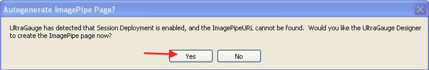
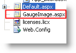

////

|metadata|
{
    "name": "webgauge-session-deployment",
    "controlName": ["WebGauge"],
    "tags": ["Deployment","How Do I"],
    "guid": "{CF7ADCBE-F904-4C8B-87D7-8B0F7140A71A}",  
    "buildFlags": [],
    "createdOn": "0001-01-01T00:00:00Z"
}
|metadata|
////

= Session Deployment

Before running an application that has a WebGauge™ control, the deployment scenario must be set up and configured.

*To enable Session State image deployment:*

[start=1]
. Select the WebGauge control on your Web form.
[start=2]
. Expand the  pick:[asp-net="link:infragistics4.webui.ultrawebgauge.v{ProductVersion}~infragistics.webui.ultrawebgauge.ultragauge~deploymentscenario.html[DeploymentScenario]"]  property.
[start=3]
. Locate the  pick:[asp-net="link:infragistics4.webui.ultrawebgauge.v{ProductVersion}~infragistics.webui.ultrawebgauge.webgaugedeploymentscenario~mode.html[Mode]"]  property and from its drop-down list, select the Session enumeration member.
[start=4]
. At this time, you will be prompted to automatically create a Web form that contains the ImagePipe component, which will allow for secure image transmission through the session.

[start=5]
. Click Yes to automatically generate the Web form and ImagePipe component.
[start=6]
. At this point, a Web form named GaugeImage has been created and added to your project.

This new WebForm will contain a reference to the GaugeImagePipe server-side component. The Gauge component on the main Web form will point to this server-side component.

The GaugeImagePipe Web form (GaugeImage.aspx) can be any Web form with a GaugeImagePipe control on it. The following code is an example of the complete text of GaugeImage.aspx, in its minimal form. Before using this Web form, the assembly name and version numbers in the Register directive must be updated to the current assembly version.

*In XML:*

----
<%@ Page %>
<%@ Register TagPrefix="igGauge"
  Assembly="Infragistics2.WebUI.UltraWebGauge.v7.1,
  version=7.1.20071.1, Culture=neutral, 
  PublicKeyToken=7dd5c3163f2cd0cb"
  Namespace="Infragistics.WebUI.UltraWebGauge" %>
<igGauge:GaugeImagePipe id="GaugeImagePipe1" runat="server" />
----