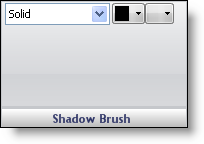

////

|metadata|
{
    "name": "webgauge-shadow-brush-pane",
    "controlName": ["WebGauge"],
    "tags": ["How Do I"],
    "guid": "{7DC79ABA-0181-4E76-9FAC-0FDF18586505}",  
    "buildFlags": [],
    "createdOn": "0001-01-01T00:00:00Z"
}
|metadata|
////

= Shadow Brush Pane

The Shadow Brush pane lets you specify the brush type and color of the shadow that you added to a property (e.g., needle marker).

pick:[asp-net="link:infragistics4.webui.ultrawebgauge.v{ProductVersion}~infragistics.ultragauge.resources.shadow~brushelement.html[Brush Type]"]  -- This drop-down list lets you change the brush type of the property.

pick:[asp-net="link:infragistics4.webui.ultrawebgauge.v{ProductVersion}~infragistics.ultragauge.resources.shadow~brushelement.html[Brush Color]"]  -- Depending on which brush type you select, the brush color list will populate with the colors available for that brush type.

Relative Bounds Editor -- This pop-up menu displays two bounds editors, link:webgauge-relative-bounds.html[Relative Bounds] and link:webgauge-relative-clip-bounds.html[Relative Clip Bounds], that allows you to determine the size and location of your brush element.

== Related Topic

link:webgauge-effects-tab.html[Effects Tab]