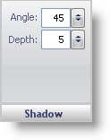

////

|metadata|
{
    "name": "webgauge-shadow-pane",
    "controlName": ["WebGauge"],
    "tags": ["How Do I"],
    "guid": "{964673E4-359A-4362-8840-F2CB9C27F802}",  
    "buildFlags": [],
    "createdOn": "0001-01-01T00:00:00Z"
}
|metadata|
////

= Shadow Pane

The Shadow pane lets you modify the angle and depth of the drop shadows on a property (e.g., an anchor).

pick:[asp-net="link:infragistics4.webui.ultrawebgauge.v{ProductVersion}~infragistics.ultragauge.resources.shadow~angle.html[Angle]"]  -- Set this value to an integer from 0 to 100. This value determines the angle of the drop shadow on a property.

pick:[asp-net="link:infragistics4.webui.ultrawebgauge.v{ProductVersion}~infragistics.ultragauge.resources.shadow~depth.html[Depth]"]  -- Set this value to an integer from 0 to 100. This value determines the distance between the drop shadow and the property (e.g., the anchor).

== Related Topic

link:webgauge-effects-tab.html[Effects Tab]