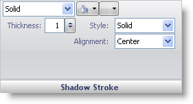

////

|metadata|
{
    "name": "webgauge-shadow-stroke-pane",
    "controlName": ["WebGauge"],
    "tags": ["How Do I"],
    "guid": "{8AA400B9-1BB5-4510-999C-5E39030C7837}",  
    "buildFlags": [],
    "createdOn": "0001-01-01T00:00:00Z"
}
|metadata|
////

= Shadow Stroke Pane

The Shadow Stroke pane allows you to add a border around the shadow you created in the link:webgauge-shadow-brush-pane.html[Shadow Brush pane].

pick:[asp-net="link:{ApiPlatform}webui.ultrawebgauge{ApiVersion}~infragistics.ultragauge.resources.strokeelement~brushelement.html[Brush Type]"]  -- This drop-down list lets you change the brush type of your property.

pick:[asp-net="link:{ApiPlatform}webui.ultrawebgauge{ApiVersion}~infragistics.ultragauge.resources.strokeelement~brushelement.html[Brush Color]"]  -- Depending on which brush type you select, the brush color list will populate with the colors available for that brush type.

Relative Bounds Editor -- This pop-up menu displays two bounds editors, link:webgauge-relative-bounds.html[Relative Bounds] and link:webgauge-relative-clip-bounds.html[Relative Clip Bounds], that allows you to determine the size and location of your brush element.

pick:[asp-net="link:{ApiPlatform}webui.ultrawebgauge{ApiVersion}~infragistics.ultragauge.resources.strokeelement~dashstyle.html[Style]"]  -- This value specifies the dash style of the shadow's border.

pick:[asp-net="link:{ApiPlatform}webui.ultrawebgauge{ApiVersion}~infragistics.ultragauge.resources.strokeelement~thickness.html[Thickness]"]  -- Set this value to an integer from 0 to 100. This value specifies the thickness of the shadow's border.

pick:[asp-net="link:{ApiPlatform}webui.ultrawebgauge{ApiVersion}~infragistics.ultragauge.resources.strokeelement~alignment.html[Alignment]"]  -- This value specifies the position of the shadow's border.

== Related Topic

link:webgauge-effects-tab.html[Effects Tab]