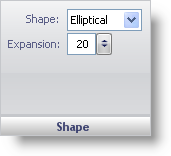

////

|metadata|
{
    "name": "webgauge-shape-pane",
    "controlName": ["WebGauge"],
    "tags": ["How Do I"],
    "guid": "{E3E5FF68-ADB0-4905-9BF1-D687A86D22C3}",  
    "buildFlags": [],
    "createdOn": "0001-01-01T00:00:00Z"
}
|metadata|
////

= Shape Pane

The Shape pane determines the shape of the dial.

pick:[asp-net="link:infragistics4.webui.ultrawebgauge.v{ProductVersion}~infragistics.ultragauge.resources.dialappearance~shape.html[Shape]"]  -- This value specifies whether the dial is elliptical or rectangle.

pick:[asp-net="link:infragistics4.webui.ultrawebgauge.v{ProductVersion}~infragistics.ultragauge.resources.dialappearance~expansion.html[Expansion]"]  -- Set this value to a value from -999 to 99.

== Related Topic

link:webgauge-dial-layout-tab.html[Dial Layout Tab]