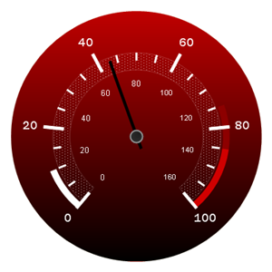

////

|metadata|
{
    "name": "webgauge-simple-gradient-brush-element",
    "controlName": ["WebGauge"],
    "tags": ["How Do I"],
    "guid": "{DF14CDD7-2F8F-433C-B6A9-EE42C20E30D4}",  
    "buildFlags": [],
    "createdOn": "0001-01-01T00:00:00Z"
}
|metadata|
////

= Simple Gradient Brush Element

If you want a property on your gauge to start with one color and fade into another color in a specific way, set the brush type to SimpleGradient. When you select the SimpleGradient brush element, you can specify the start color, end color, and gradient style. You can apply the Simple Gradient brush element to the properties on your gauge using:

* link:webgauge-apply-the-simple-gradient-brush-element-using-the-gauge-designer.html[the Gauge Designer]
* link:webgauge-apply-the-simple-gradient-brush-element-at-design-time.html[the Gauges collection editor]
* link:webgauge-apply-the-simple-gradient-brush-element-at-run-time.html[code]

The following screen shot displays a Radial gauge with the Dial's BrushElement property set to a SimpleGradientBrushElement with the following settings:

* Start color -- 192, 0, 0
* End color -- Black
* Gradient style -- Vertical

