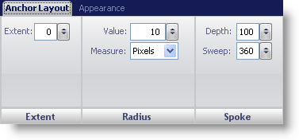
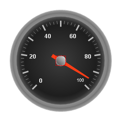

////

|metadata|
{
    "name": "webgauge-spoke-pane",
    "controlName": ["WebGauge"],
    "tags": ["How Do I"],
    "guid": "{E431C43D-2E81-4C76-8901-4D61F0DC7BD9}",  
    "buildFlags": [],
    "createdOn": "0001-01-01T00:00:00Z"
}
|metadata|
////

= Spoke Pane

The  pick:[asp-net="link:infragistics4.webui.ultrawebgauge.v{ProductVersion}~infragistics.ultragauge.resources.radialgaugeneedle~backanchor.html[Back Anchor]"]  property of the WebGauge control is used in connection with the Needle  pick:[asp-net="link:infragistics4.webui.ultrawebgauge.v{ProductVersion}~infragistics.ultragauge.resources.radialgaugescale~markers.html[Marker]"]  property. The back anchor is drawn underneath the Anchor.

You can style the back anchor on your gauge using the Back Anchor Layout tab of the Properties panel. You can access this tab by either clicking Back Anchor in the Gauge Explorer (Radial Gauge > Scales > Markers > Needle > Back Anchor) or clicking the back anchor of your Radial gauge in the interactive preview area.

The tab is divided into three panes:

* link:webgauge-back-anchor-extent-pane.html[Extent]
* link:webgauge-back-anchor-radius-pane.html[Radius]
* link:webgauge-back-anchor-spoke-pane.html[Spoke]

The following screen shot shows a back anchor that was created according to the layout settings specified in the above screen shot.

