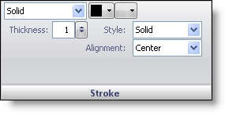

////

|metadata|
{
    "name": "webgauge-stroke-pane",
    "controlName": ["WebGauge"],
    "tags": ["How Do I"],
    "guid": "{3B711BDC-2248-4C7A-AB26-6D727A647CDC}",  
    "buildFlags": [],
    "createdOn": "0001-01-01T00:00:00Z"
}
|metadata|
////

= Stroke Pane

The Stroke pane allows you to add a border around the selected property.

pick:[asp-net="link:infragistics4.webui.ultrawebgauge.v{ProductVersion}~infragistics.ultragauge.resources.labelappearance~brushelement.html[Brush Type]"]  -- This drop-down list lets you change the brush type of your property.

pick:[asp-net="link:infragistics4.webui.ultrawebgauge.v{ProductVersion}~infragistics.ultragauge.resources.labelappearance~brushelement.html[Brush Color]"]  -- Depending on which brush type you select, the brush color list will populate with the colors available for that brush type.

Relative Bounds Editor -- This pop-up menu displays two bounds editors that, link:webgauge-relative-bounds.html[Relative Bounds] and link:webgauge-relative-clip-bounds.html[Relative Clip Bounds], allows you to determine the size and location of your brush element.

pick:[asp-net="link:infragistics4.webui.ultrawebgauge.v{ProductVersion}~infragistics.ultragauge.resources.strokeelement~dashstyle.html[Style]"]  -- This values specifies the dash style of the border.

pick:[asp-net="link:infragistics4.webui.ultrawebgauge.v{ProductVersion}~infragistics.ultragauge.resources.strokeelement~thickness.html[Thickness]"]  -- Set this value to an integer from 0 to 100. This value specifies the thickness of the border.

pick:[asp-net="link:infragistics4.webui.ultrawebgauge.v{ProductVersion}~infragistics.ultragauge.resources.strokeelement~alignment.html[Alignment]"]  -- This value specifies the position of the border.

== Related Topic

link:webgauge-appearance-tab.html[Appearance Tab]